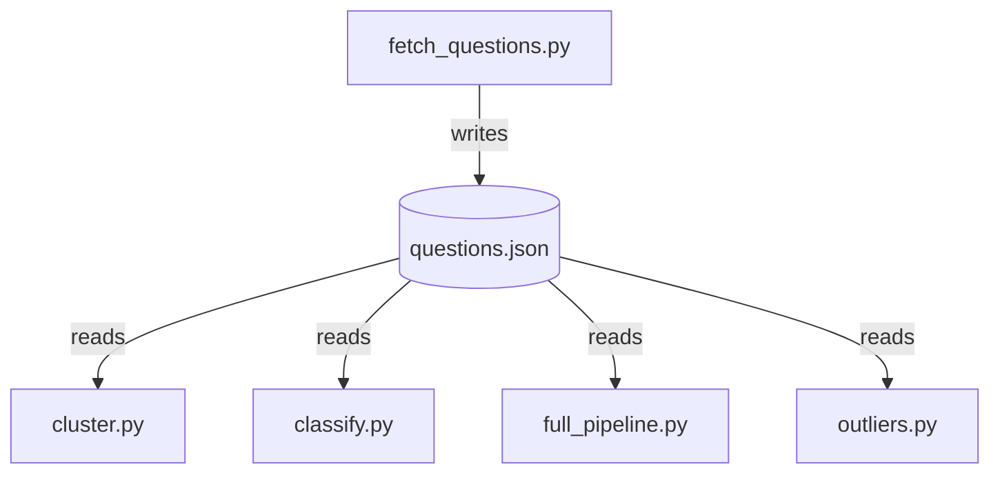

# StackOverflow Language Classifier

A learning project: can we automatically tell which programming
language (Python, R, HTML, or CSS) a StackOverflow question is about,
using nothing but the *meaning* of its title?

## What this project does

1. **Fetch real questions** from StackOverflow (not made-up examples)
2. **Cluster** them — see if an algorithm can group similar questions
   together *without ever being told* what language they're about
3. **Classify** them — train a model on questions with known answers,
   then test whether it can correctly guess the language of questions
   it's never seen
4. **Chain clustering into classification for real** — feed
   clustering's own output into the classifier's training, the way a
   real production pipeline would, instead of both techniques
   independently grading themselves against the real tags
5. **Catch questions that don't belong to any of the 4 languages at
   all** — neither clustering nor classification can say "none of
   these fit," so we test two dedicated outlier-detection approaches
   to see if *they* can

## The pipeline

| Step | File | What it does | Needs internet? |
|---|---|---|---|
| 1 | `fetch_questions.py` | Pulls 100 real questions each for `python`, `r`, `html`, `css`, saves to `questions.json` | Yes (only this step) |
| 2 | `cluster.py` | Groups the 400 questions by similarity alone (KMeans), plots that against real tags side by side | No |
| 3 | `classify.py` | Trains on the *real* tags, tests on held-out questions, guesses a brand-new question | No |
| 4 | `full_pipeline.py` | Clusters first, names each cluster once, trains the classifier on those cluster-derived names — the real chained version of steps 2+3 | No |
| 5 | `outliers.py` | Tests two different approaches (Isolation Forest, nearest-neighbor distance) for catching questions that don't belong to any of the 4 languages at all | No |

`questions.json` is the one shared file every other script reads —
`fetch_questions.py` writes it once, and `cluster.py`/`classify.py`/
`full_pipeline.py`/`outliers.py` each independently read it. They
don't depend on each other running, only on that one file existing:



```bash
cd language_classifier
../.venv/bin/python fetch_questions.py    # run once (or again for fresh data)
../.venv/bin/python cluster.py
../.venv/bin/python classify.py
../.venv/bin/python full_pipeline.py
../.venv/bin/python outliers.py
```

**Try your own question**: `classify.py`, `full_pipeline.py`, and
`outliers.py` all accept a question on the command line — if you don't
pass one, `classify.py`/`full_pipeline.py` fall back to the built-in
"center a div" example, and `outliers.py` just runs its built-in test
cases.

```bash
../.venv/bin/python classify.py "How do I merge two dictionaries in one line?"
../.venv/bin/python full_pipeline.py "How do I flatten a nested list in one line?"
../.venv/bin/python outliers.py "What's the weather like in Paris tomorrow?"
```

## Where do the labels come from?

We didn't invent them, and no model figured them out. **StackOverflow
users tag their own questions when they post them.** Asking the API
for questions `tagged: "python"` just requests questions a real human
already tagged that way — we're reusing labels that already existed,
for free.

---

## Core concepts

Everything below is explained using this project's own real numbers —
no abstract textbook examples. Each one appears exactly once here;
the results section further down just points back to these.

### Supervised vs. unsupervised vs. semi-supervised learning

The three "starting conditions" a learning technique can assume:

| | Gets labels? | Used in |
|---|---|---|
| **Supervised** | Yes, real ones, upfront | `classify.py` |
| **Unsupervised** | None at all | `cluster.py` |
| **Semi-supervised** | Derived, not real | `full_pipeline.py` |

`full_pipeline.py`'s approach — cluster first, then use each cluster's
own majority vote as a stand-in label to train a classifier — is a
real, named technique: **pseudo-labeling**. Used in industry when real
labels are scarce: label what little you can (or infer labels
automatically, like we did), train on that, and accept some accuracy
cost in exchange for not needing a human to label everything. We
measured that exact cost below — about 16 accuracy points.

### Clustering — what, why, how

**What it is**: given a pile of things with no labels, automatically
group the similar ones together. Nobody tells the algorithm what the
groups are, what to call them, or how many should exist — it just
separates the pile based on what's naturally similar.

**Why it matters, beyond this project**: most real-world data has no
labels, and manually labeling it is slow or expensive.
- A company with 100,000 unlabeled support tickets can't have a human
  read every single one
- Clustering groups them into, say, 8 clumps automatically, overnight,
  with zero manual labeling
- A human then only needs to skim each *clump* to label it (e.g.
  "cluster 3 is billing complaints") — 8 labels instead of 100,000

Other real uses: customer segmentation, fraud/anomaly detection
(anything that doesn't fit any cluster is suspicious), general
exploratory analysis.

**How KMeans does it:**
1. Pick 4 random points as starting group centers
2. Assign every question to its nearest center
3. Move each center to the middle of the questions now assigned to it
4. Repeat steps 2-3 until centers stop moving much

**Why we used it here anyway**, even though we already had real tags:
as a sanity check. If we pretend we don't know the tags, does KMeans
rediscover the same groups on its own? It did — strong evidence our
embeddings capture real structure, not coincidence.

**Proof the real tags never touch the clustering step itself** — worth
confirming in actual code, not just trusting the claim (from
`cluster.py`):

```python
real_tags = [q["tag"] for q in questions]     # loaded from the file...
kmeans.fit_predict(embeddings)                 # ...but NEVER passed in here — only embeddings
color=real_tags,                               # the ONLY other use: coloring the comparison plot, AFTER clustering
```

The clustering result would come out identical even if `real_tags`
were deleted from the script — its only job is coloring a plot
afterward so *we* can grade the algorithm's work, the same way an
answer key grades a test after it's already been turned in.

### Classification — what, why, how

**What it is**: given something new, and known categories, predict
which one it belongs to — by first learning from examples where the
answer was already known.

**How KNN decides**, a real worked example:
1. Take a new question: `"How do I center a div both horizontally and vertically?"`
2. Embed it — same `.encode()` step as everywhere else
3. Find the **5 closest questions** in the training set by embedding distance
4. Predict whichever language is most common among those 5 neighbors — the model predicted `css`

No formula gets "learned" here — it's closer to *"this resembles these
5 old examples most closely, so it's probably their category too."*

**Why it matters** — continuing the support-ticket story from above:
1. Clustering groups the 100,000 tickets into 8 clusters; a human labels each cluster once
2. 500 new tickets arrive every day. Re-clustering daily would be slow, and cluster boundaries could shift each run
3. Instead: train a classifier **once** on the now-labeled historical tickets. Every new ticket gets instantly, consistently routed from then on, no re-clustering needed

**The division of labor**: clustering discovers the categories the
first time; classification is what you build afterward to handle
everything new, quickly and consistently. Same pattern behind spam
filters, content moderation, review routing.

**Why we used it here**: `classify.py` trains on the real tags
directly — the "idealized" case where labels already exist.

### Hyperparameters, and overfitting/underfitting

- **Parameters**: values the model *learns* during training (e.g. where KMeans's 4 centers end up)
- **Hyperparameters**: values *we* choose before training starts (`n_neighbors=5` in KNN, `n_clusters=4` in KMeans, `test_size=0.2` in the split)

We picked `n_clusters=4` because we already knew there were 4 real
categories — a shortcut. In a genuine scenario where you don't know
how many groups exist, you'd try several K values and pick the best
one — a search process called **hyperparameter tuning**.

`n_neighbors` (KNN's K) is a good lens on a classic tradeoff:
- **K = 1**: a prediction depends on a single closest example — one
  unusual training point can flip the answer. Reacting to noise, not
  the real pattern — **overfitting**.
- **K = 320** (the whole training set): every prediction becomes
  "whichever language has the most examples overall," ignoring the
  actual question entirely — **underfitting**.
- **K = 5** (what we used): a middle ground, normally found by trying
  several values and checking which does best on the held-out test set.

### How we test accuracy — the train/test split

1. Split the 400 questions into two piles *before* training — 320 for training, 80 for testing
2. Train the classifier only on the 320
3. Ask it to predict the 80 it never saw
4. Compare guesses to real answers, count matches
5. Accuracy = correct guesses ÷ total test questions

```python
X_train, X_test, y_train, y_test = train_test_split(
    embeddings, labels, test_size=0.2, random_state=42,
)
classifier.fit(X_train, y_train)         # only learns from the 320 training questions
predictions = classifier.predict(X_test)  # guesses on the 80 it never saw
accuracy_score(y_test, predictions)       # counts how many guesses matched reality
```

`58.8%` of 80 test questions = **47 correct out of 80**. That's the
entire test — hold back 20%, predict it blind, count the matches.

This is different from **inference**: running the already-trained
model on one brand-new input (like the "center a div" example) to get
a single live prediction, not a batch accuracy measurement. Training
happens once; inference happens continuously, whenever the system is
actually used.

This is also different from **cluster purity** below — that's
measured on *all 400* questions with no train/test split at all, since
clustering has no "unseen data" concept the way classification does.

### Confusion matrix, precision, recall, and F1

A confusion matrix shows exactly *what* a classifier got right and
wrong — not just one accuracy percentage. Rows = the real answer,
columns = what the model predicted. This is the real one, from
`classify.py`'s actual test run:

```
Rows = actual, Columns = predicted
            css     html   python        r
    css      15        5        0        0
   html       5       14        1        0
 python       0        0       18        2
      r       0        0        7       13
```

Reading it: the `css` row shows 15 CSS questions correctly predicted
`css`, 5 wrongly predicted `html`. Adding up the diagonal (the
correct guesses): `(15+14+18+13)/80 = 60/80 = 75%` — matches the
headline accuracy exactly.

Two patterns jump out that a single accuracy number would hide:
- **css/html confuse each other symmetrically** (5 css→html, 5
  html→css) — expected, they share vocabulary (`div`, `style`, `element`)
- **r gets predicted as python far more than the reverse** (7
  r→python, 0 python→r) — asymmetric; python acts like a "gravity
  well" for generic-sounding questions

**Precision and recall** answer "how good is the model" from opposite
directions:
- **Precision**: "of everything I predicted as X, how much was
  actually X?" — measures false alarms. For python: `18/(18+1+2) = 85.7%`
- **Recall**: "of everything that's actually X, how much did I find?"
  — measures misses. For r: `13/(0+0+7+13) = 65%`

Why python has high recall but lower precision, and r the opposite:
the model is *eager* to guess python (catches most real python
questions → high recall), but that eagerness also wrongly grabs some r
questions along the way (lowers python's precision, and drags down r's
recall since those questions "leaked" into python's bucket instead).

**F1-score** is one number balancing both (their harmonic mean) —
useful when precision and recall disagree, as they do here.

### Cluster purity

In plain steps, before any formula:
1. Turn each question's text into an embedding — this step never touches tags
2. Group embeddings by similarity (clustering) — the algorithm has zero access to real tags
3. *After* grouping is already locked in, **we** look up each question's real tag
4. Compare: what group did clustering put it in, vs. what its real tag
   actually says. **That comparison, turned into a percentage, is
   purity** — of everything dumped into one group, how much of it
   matches what we ended up calling that group.

This is only possible because we happen to have real tags lying around
to check against. In a genuine no-labels scenario there'd be nothing
to compare to, and no purity number could be computed at all — it's a
grading exercise here, made possible by already having the answer key.

**Not the same as classification accuracy** — accuracy needs predicted
and true labels to already share names; clustering never predicts a
name at all (cluster `1` doesn't know it's "supposed to be" html).
Purity works around that by naming each cluster after its own majority
class first, then scoring how well that assignment holds up.

Formula, for reference:
```
Purity = (sum of each cluster's majority-class count) / (total items)
```

### Distance metrics: cosine similarity vs. Euclidean distance

- **Cosine similarity**: cares only about the *angle* between two vectors, ignores length entirely
- **Euclidean distance**: straight-line distance, which *does* depend on length

We used cosine explicitly in `compare_embeddings.py` — but
`cluster.py`, `classify.py`, and `full_pipeline.py` never specify a
distance metric at all, and scikit-learn's defaults (`KMeans`,
`KNeighborsClassifier`) are both **Euclidean**, not cosine. An
easy-to-miss inconsistency worth knowing about.

Turns out not to matter here — verified, not assumed:
```python
np.linalg.norm(embeddings[0])   # -> 1.0000
```
`all-MiniLM-L6-v2` outputs vectors already scaled to length 1. For
unit-length vectors specifically, cosine similarity and Euclidean
distance are mathematically related (`distance² = 2 − 2×cosine_similarity`)
and produce the **exact same ranking** of "which neighbor is closest"
— so the Euclidean defaults happen to agree with cosine here. A
different embedding model that doesn't normalize its output by default
could genuinely give different results.

**Lesson, generalized**: know what a library's defaults actually are —
don't assume a tool is doing what you *meant*, verify it.

### Outlier detection — why neither clustering nor classification can say "none of these"

Neither technique we've used so far can express "this doesn't belong
anywhere":
- **KMeans** assigns every point to its *nearest* center, no matter how
  far away that nearest center actually is — no "reject" option exists
- **KNN** finds the 5 closest training examples and votes among them —
  since training only ever contained python/r/html/css, there's no 5th
  "none of these" option to vote for either

We tested two dedicated techniques built specifically to answer "does
this look unlike everything else?" — a genuinely different question
from "which of my known categories does this belong to?"

**Isolation Forest, in plain steps:**
1. Repeatedly split the data at random (many times, across many random trees)
2. Measure how *few* splits it takes to isolate each point on its own
3. Points surrounded by lots of similar neighbors take many splits to
   isolate. Points that are already different get isolated almost
   immediately — fewer splits needed = higher anomaly score

**Nearest-neighbor distance, in plain steps:**
1. For a new question, find its 5 closest real questions by embedding distance (same mechanism `classify.py` uses)
2. Average those 5 distances
3. If that average is larger than normal, the question doesn't resemble anything in the known data well — flag it

### What we actually found testing these — including a correction

Isolation Forest looked promising at first: on 3 off-topic test
questions (cooking, hiking, car repair) mixed into the real 400, it
ranked a hiking question 2nd-most-anomalous out of 403.

**Before trusting that, we ran a sanity check**: does Isolation Forest
even catch an *obviously* extreme outlier — pure gibberish text with
no real sentence structure at all? It should be the easiest possible
case. It ranked the gibberish only **38th out of 401** — barely
anomalous at all. That's a red flag that something was wrong with the
*method*, not a subtle fact about the data.

Confirming with plain cosine similarity (bypassing Isolation Forest
entirely): the gibberish's *best* match among real questions had
similarity 0.207, versus 0.550 for a real question's best match to
other real questions — a real, meaningful gap. **The signal was there
in the embeddings all along; Isolation Forest just wasn't using it
well.**

Why: Isolation Forest isolates points by looking at *one random
dimension at a time* — built to catch things extreme in a *single*
feature (like `age = 999` in a spreadsheet column). Our embeddings are
384 continuous dimensions, and an off-topic question isn't extreme in
any one of them — it's *moderately* different across *many* dimensions
at once, cumulatively. Isolation Forest's one-dimension-at-a-time
splitting structurally can't see that cumulative pattern. Distance
naturally combines all 384 dimensions into a single number, so it
catches exactly the signal Isolation Forest misses:

| Test case | Isolation Forest verdict | NN distance (avg to 5 nearest) | NN verdict |
|---|---|---|---|
| gibberish | normal | 1.269 | outlier |
| cooking | normal | 1.284 | outlier |
| hiking | normal | 1.328 | outlier |
| flat tire | normal | 1.212 | outlier |
| real python question | normal | 0.874 | normal |

Nearest-neighbor distance: **5/5 correct**. Isolation Forest: **0/5**
caught (fit on the real 400 questions only, each test case checked
against that baseline — using the 1.1 distance threshold `outliers.py`
uses, picked by eyeballing this exact gap between ~0.87 and ~1.2+).

**The actual lesson isn't "Isolation Forest is bad"** — it's a
genuinely strong technique, just poorly matched to dense,
high-dimensional embedding data specifically (it does much better on
tabular data with extreme single-column values). The bigger lesson:
**verify a technique is actually working — with an obvious, easy test
case — before trusting what it tells you about harder, real ones.**

---

## What we actually found

**Clustering worked well.** The "what KMeans discovered" plot and the
"real tags" plot looked nearly identical — the algorithm independently
rediscovered essentially the same 4 groups the real tags define, with
zero labels involved in the grouping itself.

**Classification scored 75% accuracy** on 80 held-out questions (full
breakdown in [Confusion matrix, precision, recall, and F1](#confusion-matrix-precision-recall-and-f1)
above). Live test on a brand-new question:
```
"How do I center a div both horizontally and vertically?"
Predicted language: css
```
A defensible guess — that question could realistically be tagged
either `css` or `html` in real life too.

**The full chained pipeline was more humbling.** The side-by-side
plots from `cluster.py` looked visually similar, but naming each
cluster individually revealed real impurity underneath (mechanics in
[Cluster purity](#cluster-purity) above):

| Cluster | Named | Purity |
|---|---|---|
| 0 | `r` | 67/73 = **92%** |
| 2 | `python` | 94/136 = **69%** |
| 3 | `css` | 38/62 = **61%** |
| 1 | `html` | 70/129 = **54%** — barely over half! |

The accuracy chain, end to end:
```
Clustering + naming alone (no classifier yet):       67.2%
Full pipeline (cluster -> name -> train classifier):  58.8%
compare to: classify.py trained on REAL tags:         75.0%
```

Two real findings:
1. **Training a classifier on the noisy derived labels made things
   worse, not better** (67.2% → 58.8%). KNN is a different algorithm
   from KMeans and doesn't even perfectly reproduce KMeans's own
   groupings — errors from clustering and classification **compound**
   rather than cancel out.
2. **The realistic no-labels pipeline lands ~16 points below the
   idealized one** (58.8% vs 75%). That gap *is* the real, measurable
   cost of not having real human-provided labels.

One steady point: the live test question still predicted `css` either
way — the degraded pipeline still landed on a defensible answer for
that particular example, even though its overall reliability dropped.

## Takeaway

Embeddings capture *meaning* well enough that both an unsupervised
algorithm (KMeans) and a supervised one (KNN) could recover real
programming-language structure from nothing but question titles — but
neither is perfect where topics genuinely overlap (HTML/CSS) or where
short text lacks language-specific signal (generic phrasing shared by
Python/R).

Chaining them into one realistic pipeline (`full_pipeline.py`) made
the cost of that imperfection concrete: every stage without a
human-verified label leaks error into the next stage, and here that
cost measured out to roughly 16 accuracy points versus having real
labels all along. Clustering and classification are genuinely
complementary tools — clustering is what you reach for first when you
have nothing, classification is what makes that first pass reusable at
speed — but chaining them is not free, and now we have an actual
number for what it costs.

Testing outlier detection (`outliers.py`) added one more lesson beyond
the main pipeline: even a well-regarded technique (Isolation Forest)
can quietly fail on data it's a poor match for, and the only way we
caught that was by testing it against an *easy*, obvious case
(gibberish text) before trusting its verdict on harder, real ones. The
fix was a simpler technique (nearest-neighbor distance), not a more
complex one — worth remembering before reaching for something fancier.
