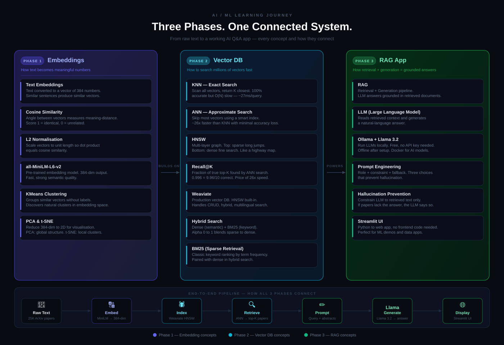

# AI Concepts

Hands-on learning projects built while studying AI/ML engineering.
Each folder is a self-contained project with its own README, concepts file, and runnable code.



---

## Projects

### [Embedding/](Embedding/)
**Sentence embeddings — from similarity to classification**

Covers how text is converted into vectors, how to measure similarity between them,
and how to build a language classifier using only embeddings — no neural network training.

| What | Where |
|------|-------|
| Core concepts | [Embedding/README.md](Embedding/README.md) |
| Sentence similarity | [compare_embeddings.py](Embedding/compare_embeddings.py) |
| PCA + t-SNE visualization | [visualization/](Embedding/visualization/) |
| Language classifier (KMeans, KNN, outlier detection) | [language_classifier/](Embedding/language_classifier/) |

**Key concepts:** embeddings, cosine similarity, L2 normalization, KMeans clustering,
KNN classification, PCA, t-SNE, outlier detection.

---

### [Vector DB/](Vector%20DB/)
**Vector databases — from HNSW from scratch to Weaviate**

Built a full semantic search engine over 20K ArXiv AI/ML papers. Phase 1 implements
HNSW from scratch. Phase 2 replaces it with Weaviate and extends to hybrid and
multilingual search.

| What | Where |
|------|-------|
| Core concepts | [Vector DB/README.md](Vector%20DB/README.md) |
| Phase 1 — HNSW from scratch | [semantic_search/](Vector%20DB/semantic_search/) |
| Phase 1 concepts (distance, KNN, ANN, HNSW, recall@K) | [semantic_search/CONCEPTS.md](Vector%20DB/semantic_search/CONCEPTS.md) |
| Phase 1 algorithm deep dive | [semantic_search/hnsw/README.md](Vector%20DB/semantic_search/hnsw/README.md) |
| Phase 2 — Weaviate integration | [weaviate_search/](Vector%20DB/weaviate_search/) |
| Phase 2 concepts (CRUD, hybrid, multilingual) | [weaviate_search/CONCEPTS.md](Vector%20DB/weaviate_search/CONCEPTS.md) |

**Key concepts:** vector search, brute-force KNN, ANN, HNSW, recall@K, Weaviate,
CRUD, BM25, dense vs sparse vs hybrid search, multilingual embeddings.

**Phase 1 benchmark (20K vectors, 384 dims):**
```
Flat (brute force): 27ms/query
HNSW (hand-built):   1ms/query  →  26.5× faster, recall@10 = 0.996
```

---

### [RAG/](RAG/)
**Retrieval Augmented Generation — a full question-answering app**

Combines Weaviate (vector search) with Ollama (local LLM) to answer questions
grounded in 25,000 real AI/ML research papers. Built with a Streamlit UI —
runs entirely on your Mac, no API keys, no cloud cost.

| What | Where |
|------|-------|
| Core concepts | [RAG/README.md](RAG/README.md) |
| RAG theory (LLMs, prompting, grounding) | [RAG/CONCEPTS.md](RAG/CONCEPTS.md) |
| Setup guide (Ollama, Llama 3.2) | [RAG/SETUP.md](RAG/SETUP.md) |
| Data pipeline | [download_data.py](RAG/download_data.py), [build_embeddings.py](RAG/build_embeddings.py) |
| Retrieval | [retriever.py](RAG/retriever.py) — Weaviate HNSW + ANN search |
| Generation | [generator.py](RAG/generator.py) — Ollama API + prompt engineering |
| App | [app.py](RAG/app.py) — Streamlit dark-themed UI |

**Key concepts:** RAG, LLMs, prompt engineering, hallucination prevention,
Ollama, Llama 3.2, Streamlit, grounding, context injection.

**Dataset:** 25K ArXiv AI/ML papers (2018–2021) — covers BERT, GPT-2, GPT-3,
transformers, diffusion models, vision transformers, and more.

---

## Stack

- **Language:** Python 3.14
- **Embeddings:** `sentence-transformers` (`all-MiniLM-L6-v2`, `paraphrase-multilingual-MiniLM-L12-v2`)
- **Vector DB:** Weaviate (embedded mode)
- **LLM:** Llama 3.2 via Ollama (local, free)
- **UI:** Streamlit
- **Numerics:** NumPy, pandas
- **Visualization:** Plotly

## Course references

- [DeepLearning.AI — Vector Databases: From Embeddings to Applications](https://learn.deeplearning.ai/courses/vector-databases-embeddings-applications)
